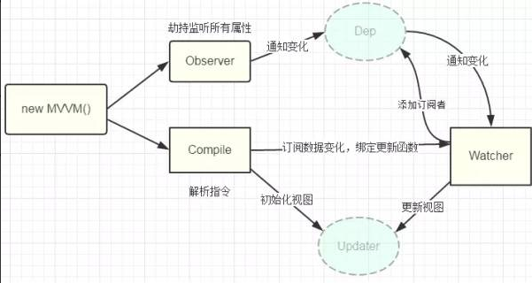

### Vue
#### 1、生命周期 
- beforeCreate

- created

- beforeMount

- mounted

- beforeUpdate

- updated

- activated

- deactivated

- beforeDestroy

- destroyed

- errorCaptured（v2.5.0+）

  

  


#### 2、指令

> v-once、v-bind、v-on、v-if、v-else、v-else-if、v-for、v-show、v-model、v-text、v-html、v-slot、v-pre、v-cloak

###### 自定义指令

```javascript
// 全局
Vue.directive('focus',{
	bind(){},//指令第一次绑定元素时调用
	inserted(){},//被绑定元素插入父节点时调用（父节点不一定已插入到文档中）
	update(){},//所在组件的VNode更新时调用
	componentUpdated(){},//指令所在组件的VNode及其子VNode全部更新后调用
	unbind(){}//指令与元素解绑时调用
})
// 组件内
directives:{
	focus:{
		// 指令内容	
	}
}
```

函数参数（el、bind、vnode、oldVnode）

除了el，其它均为只读。
```javascript
el //指令绑定的元素，可直接操作DOM
binding{
	name //指令名
	value //指令绑定值
	oldValue //指令前一个绑定值，仅在update和componentUpdated中可用。
	expression //字符串形式的指令表达式（指令绑定的内容）
	arg //指令参数（指令’:‘后面的参数），可选
	modifiers //包含所有指令修饰符的对象
}
vnode // vue编译生成的虚拟节点
oldVnode // 上一个虚拟节点，仅在update和componentUpdated中可用。
```

#### 3、组件通讯

###### 父向子传递

1. `props`或`$attr`+`inheritAttrs`（使父不作为props绑定的属性作为props，通过`$attr`访问）
2. 使用`ref`赋予子组件ID引用或使用`$children`，获取子组件实例，修改数据或调用函数
3. `provide / inject`（子孙后代注入依赖）


###### 子向父传递

1. 父给子绑定自定义事件，让子组件触发`$emit('event-name')`
2. 子组件使用`$parent`获取父组件实例，修改数据或调用函数

###### 兄弟组件

1. `EventBus`（事件总线，使用另外的`Vue`实例，通过\$on监听和\$emit触发）
2. `vuex`
3. 另一个`Vue`实例响应数据
4. `localStorage`+`storage`事件
5. `postMessage`+`message`事件
6. `hash`+`hashchange`事件

可划分为以下几类

- props
- v-on+$emit
- \$children/$parent
- `vue` instance（另一个实例）
- `vuex`
- inject/provider
- `localStorage`
- `postMessage`
- `hash`

#### 4、`mixins`&`extends`

**`mixins`**：Array<Object>，接受混入对象的数组，将在`Vue.extend()`里最终选择相同的选项合并逻辑合并，混入的`Mixin`钩子按传入顺序调用，混入的组件自身钩子最后调用。

**`extends`**：Object | Function，声明扩展另外一个组件（对象或构造函数）。

注意点：

- 除了钩子函数，其它对象键名冲突时，取组件对象的键值对（组件优先）
- 同个钩子函数按传入顺序调用，最后调用组件内的钩子

#### 5、原理

##### 5.1 MVVM

- Model 数据模型
- View UI组件，视图层，将Model转化成UI展现出来
- ViewModel 业务逻辑层，同步View和Model的对象，监听模型数据的改变和控制视图行为，处理用户交互



##### 5.2 数据绑定的方式：

- 发布者-订阅者模式
- 脏值检查
- 数据劫持


`Vue`采用数据劫持结合发布者-订阅者模式的方式，通过`Object.defineProperty()`来劫持属性的`setter`、`getter`，在数据变动是发布消息给订阅者，触发相应的监听回调。

1. 普通JavaScript对象传给Vue实例作为data选项，Vue遍历对象的属性，用Object.defineProperty为属性加上setter和getter，修改对象属性时，触发setter，通知相关的订阅者。
2. compile解析模板指令，替换模板中的变量，初始化渲染页面视图，并将知道对应的节点绑定更新函数，添加数据监听的订阅者，当数据变动时会受到通知，更新视图。
3. Watcher订阅者是Observer和Compile之间的通讯桥梁，主要负责：
   - 在自身实例实例化时在属性订阅器（dep）上进行注册
   - 提供update()方法
   - 属性变动收到订阅器通知时，调用update()方法，触发Compile中绑定的回调。
4. MVVM作为数据绑定的入口，整合Observer和、Compile和Watcher三者，通过Observer监听model数据变化，通过Compile解析编译模板指令，利用Watcher作为Observer和Compile通讯的桥梁，达到数据变化 -> 视图更新；视图交互变化 ->数据model变更的双向绑定效果。


`Vue`数据响应变化主要涉及 **`Observer`**、 **`Watcher`** 、 **`Dep`** 这三个类。（`Dep：dependence` ，依赖）

- Observer类主要用于给`Vue`的数据`DefineProperty`增加getter/setter方法，并且在getter/setter中收集依赖或者通知更新（通过依赖收集，更加细粒度去更新状态有变化的组件）。
- Watcher类用于观察数据（或者表达式）变化然后执行回调函数（其中也有收集依赖的过程），主要用于$watch API和指令上。
- Dep类是一个可观察对象，可以有不同的指令去订阅它（多传播）

`Vue`的每个组件实例都对应一个 **watcher** 实例，它会在组件渲染的过程中把“接触”过的数据属性记录为依赖。之后当依赖项的 setter 触发时，会通知 watcher，从而使它关联的组件重新渲染。


##### 5.3 Proxy vs defineProperty

###### defineProperty缺点

- 不能监听数组变化
- 需要遍历对象的属性
- 需要深层遍历嵌套的对象

###### Proxy优点

- 代理整个对象，不需要单独劫持属性
- 支持数组
- API更丰富
- Proxy作为新标准受到浏览器厂商重点关注和性能优化


#### 6、vue-router

##### 6.1导航守卫

1. 全局守卫
   - `router.beforeEach`
   - `router.beforeResolve`
   - `router.afterEach `
2. 路由独享守卫
  - `beforeEach`
  - `beforeResolve`
  - `afterEach`
  
3. 路由组件内的守卫

   - `beforeRouteEnter`
   - `beforeRouteUpdate` 
   - `beforeRouteLeave`

> 执行全局守卫，再执行路由独享守卫


##### 6.2路由实现 Hash & history

###### hash

- 通过hashchange事件监听路由变化

###### history

- 使用 history API，通过window.history.(pushState/replaceState/go)操作浏览器的history对象

- 结合window.onpopstate监听浏览器的返回和前进事件

- 需要服务端配置，并且vue应用里提供404页面

  ```nginx
  # nginx
  location / {
  	try_files $uri $uri/ @router;
  	index  index.html index.htm;
  }
  location @router {
  	rewrite ^.*$ /index.html last;
  }
  ```

  

#####6.3传参

- query
- params
- 动态路由传参（/user/:id）
- 路由组件传参（布尔/对象/函数模式）


##### 6.4编程式导航（跳转）

- \<router-link :to={path:'',query:{},params:{}}  :replace="true|false"\>
- router.(push/replace/go/back/forward)


##### 6.5路由 + 微信相关

1. 微信授权跳转时，hash模式下连接带#号可能会导致重定向跳转失败，可使用微信授权跳转处理地址

   ```javascript
   let _url = encodeURIComponent(location.href)
   location.href = `https://open.weixin.qq.com/connect/oauth2/authorize?appid=${this.appid}&redirect_uri=${_url}&response_type=code&scope=snsapi_base&state=#wechat_redirect
   ```

   *注：encodeURIComponent会编码非数字字母

2. 获取 wxconfig 配置

   - 前端传url
   - 后端获取config，传回前端
   - 前端调用wx.config

   ```javascript
   let url = location.href.split('#')[0]
   http.get('weixin/config',{
       params:{
           url: encodeURIComponent(url)
       }
   })
   .then(res=>{
       wx.config({
           beta: true,        // 必须这么写，否则wx.invoke调用形式的jsapi会有问题
           debug: false,                       // 开启调试模式,调用的所有api的返回值会在客户端alert出来，若要查看传入的参数，可以在pc端打开，参数信息会通过log打出，仅在pc端时才会打印。
           appId: res.data.appId,           // 必填，企业微信的corpID
           timestamp: res.data.timestamp,  // 必填，生成签名的时间戳
           nonceStr: res.data.nonceStr,   // 必填，生成签名的随机串
           signature: res.data.signature,// 必填，签名，见 附录-JS-SDK使用权限签名算法
           jsApiList: ['scanQRCode'] // 必填，需要使用的JS接口列表，凡是要调用的接口都需要传进来
       })
       // 检测微信
       wx.error(function(res){
           //  config信息验证失败会执行error函数，如签名过期导致验证失败，具体错误信息可以打开config的debug模式查看，也可以在返回的res参数中查看，对于SPA可以在这里更新签名。
           console.log('错误信息====',res)
       })
   })
   ```


#### 7、vuex


- 为vue应用开发的状态管理模式
  - state 驱动应用的数据源
  - view 以生命访问将state映射到视图
  - actions 响应在view上的用户输入导致的状态变化
- 集中式存储管理应用的所有组件的状态


###### 核心概念

- State
- Getter
- Mutation
- Action
- Module

基本写法：

```javascript
const store = new Vuex.Store({
  state: {
    numbers:[1,2,3,5]
  },
  getters：{
    firstNumber:state=>{
      return state.numbers.length>0 && state.numbers[0]
    }
  }，
  mutations: {//修改state的唯一途径,在这异步操作会造成state的改变不可追踪，难以定位问题或调试
    pushFn (state,number) {
      state.numbers.push(number)
    }
  },
  actions: {//通过commit mutations改变state，可进行一步操作
    pushFn (context,number) {
        setTimeout(()=>{
          context.commit('pushFn',rootState.number.length + number)            
        },3000)
    }
  },
  modules:{
      // ...划分模块，moduleA下的写法和上面一样，可以不断划分子模块
      a:moduleA,
      b:moduleB
  }
})
//使用模块
store.state.a.numbers
// 触发actions
store.dispatch('pushFn', 555)
```

#### 8、Vue虚拟DOM

 一个JS对象，存储DOM树结构。

过程：

1. 创建dom树
2. 利用diff算法进行对比，存储差异patches（补丁）对象，包括以下变化
   - 节点类型改变
   - 属性改变
   - 文本改变
   - 增加/移动/删除子节点
3. 渲染差异
   - 遍历patches，将需要修改的节点取出来
   - 举报更新dom，利用doccument.fragments操作dom，进行浏览器一次性更新


#### 9、vue VS react

|               | vue                                                          | react                                                        |
| ------------- | ------------------------------------------------------------ | ------------------------------------------------------------ |
| 数据响应      | 使用Object.defineProperty，在getter中实现依赖收集，细粒度更新组件 | state改变，整个组件更新，通过diff对比前后虚拟dom，patch到dom |
| state更改方式 | 赋值修改，数组可调用vue重写的方法修改；由于defineProperty需要递归去不断监听state数据，state数据庞大导致初次消耗大。 | 函数式编程，shouldComponentUpdate是浅比较，直接修改对象或数组，组件不会发生更新 |
| 逻辑复用      | 自定义指令                                                   | mixin、高阶组件、renderProps                                 |
| 数据流向      | 单向数据流                                                   | 单向数据流                                                   |
| ts支持        | 虽然支持，体验一般                                           |                                                              |
| 社区          | 不太活跃，组件质量不够高                                     | 活跃，方案和成熟的组件多                                     |
| diff          | 广度优先遍历                                                 | 广度优先遍历                                                 |

