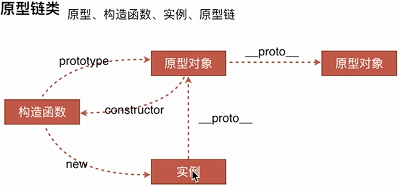

## 1 JS引擎相关

### 1.1 任务队列

- JS分为同步任务、异步任务。
- 同步任务在**主线程**上执行，形成一个**Call Stack**（执行栈）。
- 主线程之外，**事件触发线程**管理着一个**Task Queue**（任务队列），当异步任务完成时，会指定对应的事件（回调）进入Task Queue。
- 一旦Call Stack（执行栈）中所有同步任务执行完毕（此时JS引擎空闲），系统就会读取Task Queue，将Task Queue中可运行的事件添加到Call Stack（执行栈）中，开始执行。

> - **事件循环**是通过**任务队列**机制来进行协调的。
> - 一个Event Loop中，可以有一个或者多个任务队列（task queue），一个任务队列就是一系列有序任务（task）的集合
> - 每个任务都要一 个任务源（task source），源自同一个任务源的task必须放到同一个任务队列，从不同源来的则被添加到不同队列。
> - setTimeout/Promise等API便是任务源，而进入任务队列的是他们指定的具体执行任务。


### 1.2 宏任务

- (macro)task（宏任务），可以理解为每次执行栈执行的代码就行一个宏任务（包括每次从Task Queue中获取一个事件（回调）并放到执行栈中执行）。
- macrotask中的事件（回调）都是放在一个事件队列中（Task Queue）的，而这个队列由**事件触发线程**维护。
- 浏览器为了能够使得JS内部(macro)task与DOM任务能够有序地执行，会在一个task执行结束后，在下一个task执行开始前，对页面进行渲染（task->渲染->task->......）。
- macrotask主要包含：script（整体代码）、setTimeout/setInterval、I/O、UI交互事件、postMessage、MessageChannel（创建消息通道传递消息的api，可用在iframe上）、setImmediate(Node.js环境)

### 1.3 微任务

- microtask（又称为微任务），可以理解是当前task执行结束后立刻执行的任务（在当前macrotask后，渲染前，下一个macrotask前）。
- 产生的microtask会添加到微任务队列（Microtask Queues）中，该队列由JS引擎线程维护。
- 响应速度比macrotask（例如setTimeout）会更快，因为无需等渲染。（某个macrotask执行后，就会将在它执行期间产生的所有microtask都执行完毕（在渲染前））。
- microtask主要包含：Promise.then（原生的，部分实行可能是task）、MutationObserver（监听DOM变化的api）、process.nextTick（Node.js环境）。

> 微任务和宏任务皆为异步任务，主要区别在于他们的执行顺序，Event Loop的走向和取值。

### 1.4 运行机制

> 在事件循环（Event Loop）中，每进行一次循环操作成为tick，每一次tick的任务处理模型是比较复制的，但关键步骤如下：

- 执行**Call Stack**（执行栈）一个宏任务（栈中没有就从事件队列（Task Queue）中获取）
- 执行过程中如果遇到微任务，就将它添加到微任务的任务队列中
- 宏任务执行完毕后，立即执行当前微任务队列中的所有微任务（依次执行）
- 当前宏任务执行完毕，开始检查渲染，然后GUI线程接管渲染
- 渲染完毕后，JS线程继续接管，开始下一个宏任务（从事件队列中获取）


## 2. 闭包

在MDN上的描述：

> 闭包指那些能够访问**自由变量**的函数。

自由变量：

> 指在函数中使用的，但既不是函数参数也不是函数局部变量的变量。

所以:

> 闭包 = 函数 + 函数能够访问的自由变量

在`ECMAScript`中，闭包指的是：

1. 从理论角度：所有的函数。
   - 因为函数中可以访问全局变量（相当于自由变量）。
2. 从实践角度：以下函数才算是闭包：
   1. 即使创建它的上下文已经销毁，它仍然存在（比如，内部函数从父函数中返回）
   2. 在代码中引用了自由变量

注：更详细请参考”Javascript深入系列“中对闭包的理解。

### 2.1 用途

- 设计私有方法和变量
- 单例模式
- 模块化——使用闭包模块化代码，减少全局变量的使用

### 2.2 缺陷

- 闭包会常驻在内存中，不会被垃圾回收机制主动回收，增大内存使用量，使用不当容易泄露
- 闭包对脚本性能有负面效果，比如处理速度和内存消耗


## 3. 原型链



> 实例、构造函数、原型对象

- 实例 = new 构造函数()
- 实例.\_\_proto\_\_ === 原型对象
- 构造函数.prototype === 原型对象
- 原型对象.constructor === 构造函数
- 原型对象.\_\_proto\_\_ === 原型链上一级的原型对象


## 4. New运算符

>  new 运算符可以创建一个用户定义的**对象类型**或**具有构造函数的内置对象类型**的实例。

new做了什么？

1. 创建了一个全新的对象。
2. 这个对象会被执行`[[Prototype]]`（也就是`__proto__`）链接。
3. 生成的新对象会绑定到函数调用的`this`。
4. 通过`new`创建的每个对象将最终被`[[Prototype]]`链接到这个函数的`prototype`对象上。
5. 如果函数没有返回对象类型`Object`(包含`Functoin`, `Array`, `Date`, `RegExg`, `Error`)，那么`new`表达式中的函数调用会自动返回这个新的对象。

模拟实现：

``` javascript
function objectFactory() {
    // 1.用new Object() 的方式新建了一个对象 obj
    var obj = new Object();
    // 2.取出第一个参数，就是我们要传入的构造函数。此外因为 shift 会修改原数组，所以 arguments 会被去除第一个参数
    var Constructor = [].shift.call(arguments);
    // 3.将 obj 的原型指向构造函数，这样 obj 就可以访问到构造函数原型中的属性
    obj.__proto__ = Constructor.prototype;
    // 4.使用 apply，改变构造函数 this 的指向到新建的对象，这样 obj 就可以访问到构造函数中的属性
    var ret = Constructor.apply(obj, arguments);
    // 5.返回的值是不是一个对象，如果是一个对象，我们就返回这个对象，如果没有，我们该返回什么就返回什么。
    return typeof ret === 'object' ? ret : obj;

};
```


## 5. arguments

是一个类数组对象：拥有一个 length 属性和若干索引属性的对象。

Arguments 对象：

> 只定义在函数体中，包括了函数的参数和其他属性。
>
> 在函数体中，arguments 指代该函数的 Arguments 对象。

- length属性，表示实参的长度
- callee 属性，通过它可以调用函数自身

注意要点：

- argument 和对应参数的绑定

  - 非严格模式下，传入的参数，实参和 arguments 的值会共享，当没有传入时，实参与 arguments 值不会共享

- 传递参数

  - 将参数从一个函数传递到另一个函数

- 解构，可用转成数组

  ```javascript
  function func(...arguments) {
      console.log(arguments); // [1, 2, 3]
  }
  func(1, 2, 3);
  ```

应用：

1. 参数不定长
2. 函数柯里化
3. 递归调用
4. 函数重载


## 6. this

1. 作为普通函数在全局环境被调用，this 指向 window。
2. 作为对象的属性被调用，this 就指向这个对象。
3. 作为构造函数被调用，this 代表它即将 new 出来的对。 
4. 作为 call/apply/bind 方法的调用，this 指向传入的值。
   - 调用bind 后返回的函数，已绑定this，使用call/apply也无法改变。
5. 严格模式下，全局环境中执行函数调用的时候 this 并不会指向 window 而是会指向 undefined。
6. setTimeout、setInterval中的this，this 默认指向 window 对象，除非手动改变 this 的指向。
   - setTimeout 中的回调函数在严格模式下也指向 window 而不是 undefined。
7. 构造函数 prototype 属性，this 也代表当前对象的值。
8. Eval函数，this 指向当前作用域的对象。
9. 箭头函数， this 始终指向外部对象
   - 不能使用 call, apply, bind 等方法来改变 this 的指向。

